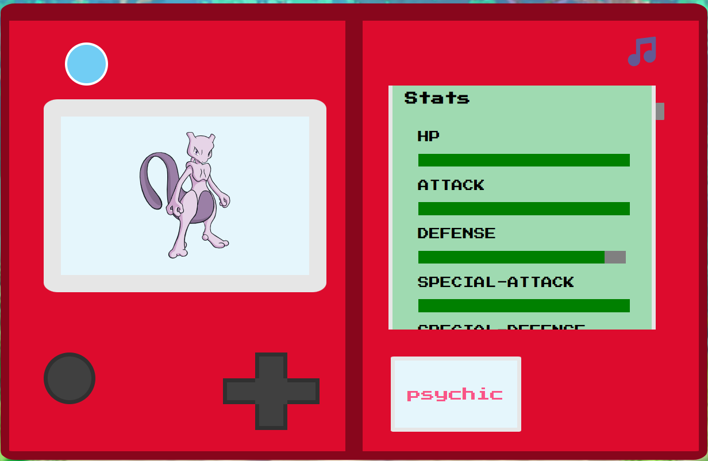

# Pokedex

Built using [PokeAPI](https://pokeapi.co/docs/v2) to render pokémon information.
Also implemented some functionalities such as pokémon searching and navigation.

### Running example:

[Pokédex App](https://pokedex-soup.onrender.com/)

#### Prints

Description:

Stats:

## HTML/CSS Credits:

Pokédex HTML model by @negus-marko

https://codepen.io/negus-marko/pen/ZEGzzgj